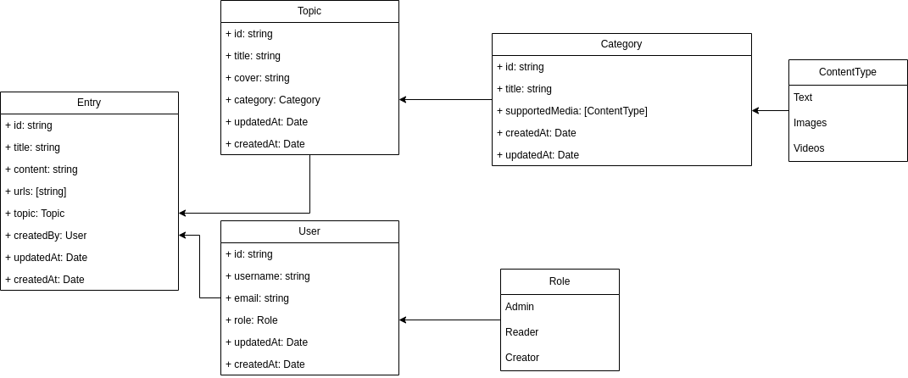

# MERN media challenge

This proyect is a proposed solution for the challenge of the company "Disruptive Studios" for the position of "MERN Fullstack".

## The challenge
please refer to the file "Challenge.pdf" for the full description of the challenge.

## Run the project

### Backend
I implemented the solution with nestjs and mongo

#### steps:

1. Run yarn install
2. Create a .env file starting from the .env.example file and fill the required variables
3. Run seed.mjs script
4. Run yarn start
5. Swagger documention can be found [GET]/docs 

### Frondent

I implemented this solution with a nextjs proyect with next tegnologies:

- React
- mui v5
- formik
- react-query.

#### steps: 
1. Run yarn install
2. check .env files by default will listen on port 3000
3. run yarn build and a yarn start
4. navigate localhost:3000.
5. you can use the seeded user "admin"

### Limitation

I run out of time to implement the testing case. :S

### Happy Review

